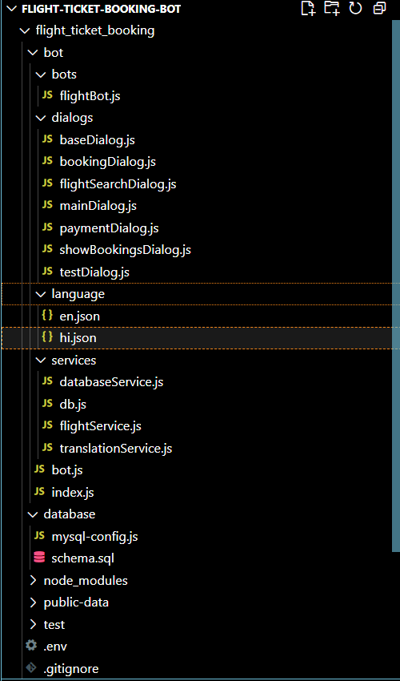
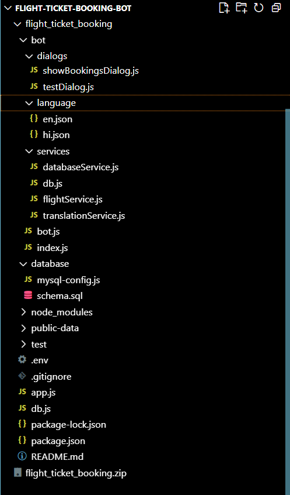

# ✈️ Flight Ticket Booking Chatbot

This is an intelligent **Flight Ticket Booking Chatbot** built using the **Microsoft Bot Framework**, **Node.js**, **Express**, and **MySQL**. The bot streamlines the process of booking, viewing, and managing flights through a conversational interface.

---

## 📁 Project Structure




---


## 🔧 Technologies Used

- Node.js
- Microsoft Bot Framework SDK
- Express.js
- MySQL
- dotenv
- botbuilder-dialogs
- botbuilder

---

## 🧪 Prerequisites

- **Node.js v14+**
- **MySQL Server**
- **Bot Framework Emulator** (for testing)

---

## 💾 Setup Instructions

1. **Clone the Repository**

```bash
git clone https://github.com/your-username/flight_ticket_booking.git
cd flight_ticket_booking
```

2. **Install Dependencies**

```bash
npm install
```

3. **Configure `.env`**

Create a `.env` file in the root directory:

```
DB_HOST=localhost
DB_USER=root
DB_PASSWORD=yourpassword
DB_NAME=flight_ticket_booking
PORT=3978
```

4. **Setup MySQL Database**

```sql
CREATE DATABASE flight_ticket_booking;

USE flight_ticket_booking;

CREATE TABLE flights (
  id INT AUTO_INCREMENT PRIMARY KEY,
  origin VARCHAR(3) NOT NULL,
  destination VARCHAR(3) NOT NULL,
  departure DATETIME NOT NULL,
  arrival DATETIME NOT NULL,
  price DECIMAL(10,2) NOT NULL,
  seats INT NOT NULL,
  airline VARCHAR(50) NOT NULL
);

CREATE TABLE users (
  id VARCHAR(255) PRIMARY KEY,
  name VARCHAR(100) NOT NULL,
  email VARCHAR(100)
);

CREATE TABLE bookings (
  id INT AUTO_INCREMENT PRIMARY KEY,
  flight_id INT NOT NULL,
  user_id VARCHAR(255) NOT NULL,
  passengers INT NOT NULL,
  total_price DECIMAL(10,2) NOT NULL,
  booking_date DATETIME DEFAULT CURRENT_TIMESTAMP,
  status ENUM('confirmed', 'cancelled') DEFAULT 'confirmed',
  FOREIGN KEY (flight_id) REFERENCES flights(id),
  FOREIGN KEY (user_id) REFERENCES users(id)
);

-- Insert mock data
INSERT INTO flights (origin, destination, departure, arrival, price, seats, airline)
VALUES
('UDR', 'DEL', '2025-07-25 08:00:00', '2025-07-25 10:00:00', 150.00, 100, 'Air India'),
('DEL', 'UDR', '2025-07-26 18:00:00', '2025-07-26 20:00:00', 140.00, 100, 'IndiGo');
```

5. **Start the Bot**

```bash
npm start
```

You should see:
```
✅ Successfully connected to MySQL database
Server running on port 3978
Health check: http://localhost:3978/health
```

---

## 💬 Test with Bot Framework Emulator

- Launch the [Bot Framework Emulator](https://github.com/microsoft/BotFramework-Emulator)
- Connect to the bot using:
  ```
  http://localhost:3978/api/messages
  ```

---

## 🛠 Future Enhancements

- ✅ Add flight cancellation logic
- 🌐 Integrate real-time flight APIs
- 📧 Email/SMS booking confirmations
- 🧾 Generate downloadable tickets

---

## 🤝 Contributing

Pull requests are welcome. For major changes, open an issue first to discuss what you would like to change.

---

## Author

Kanishka Khatri

Project- Flight Ticket Booking Bot